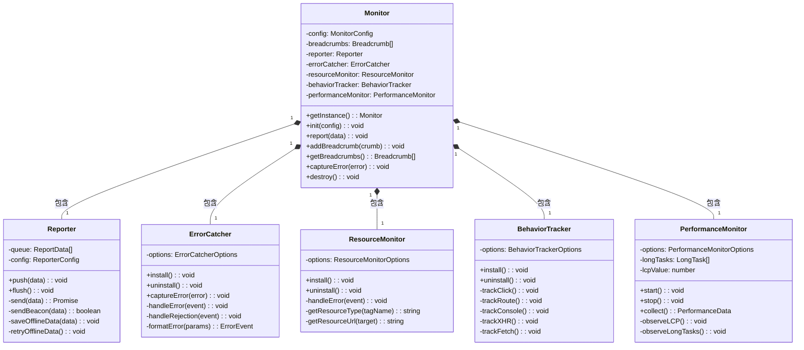
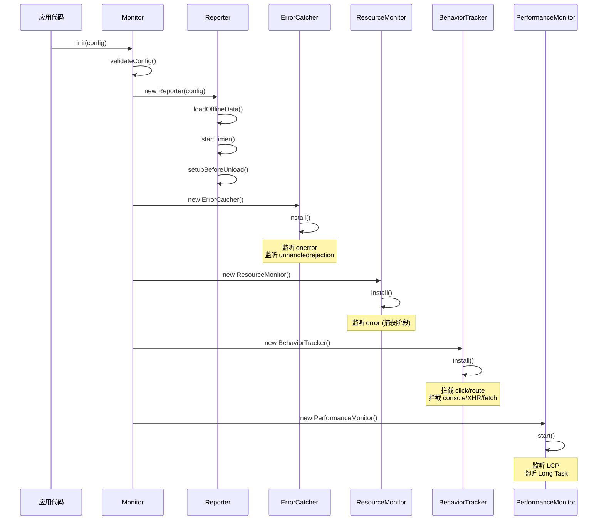
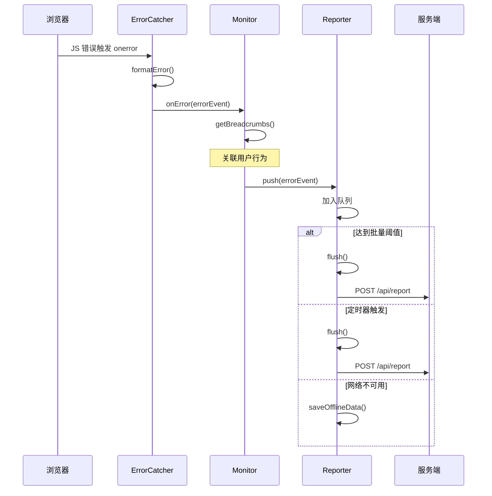
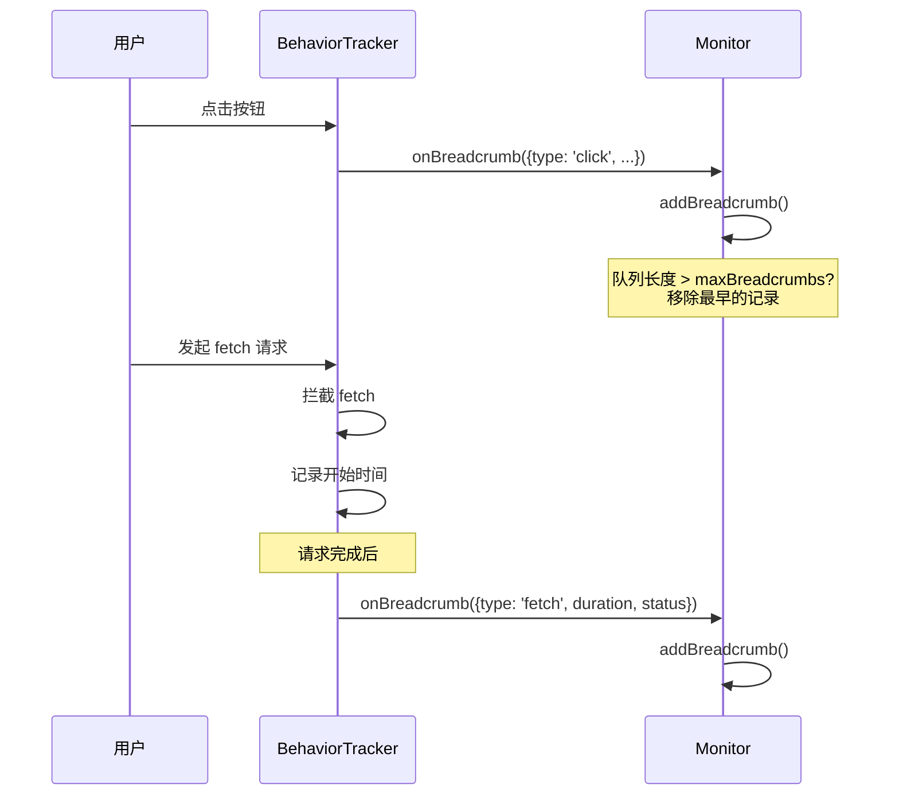
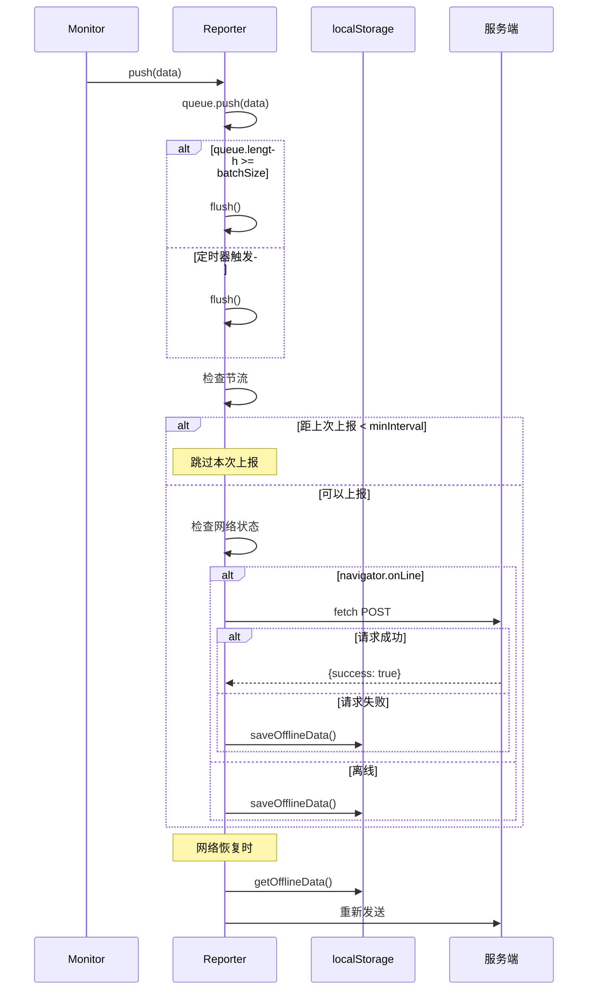
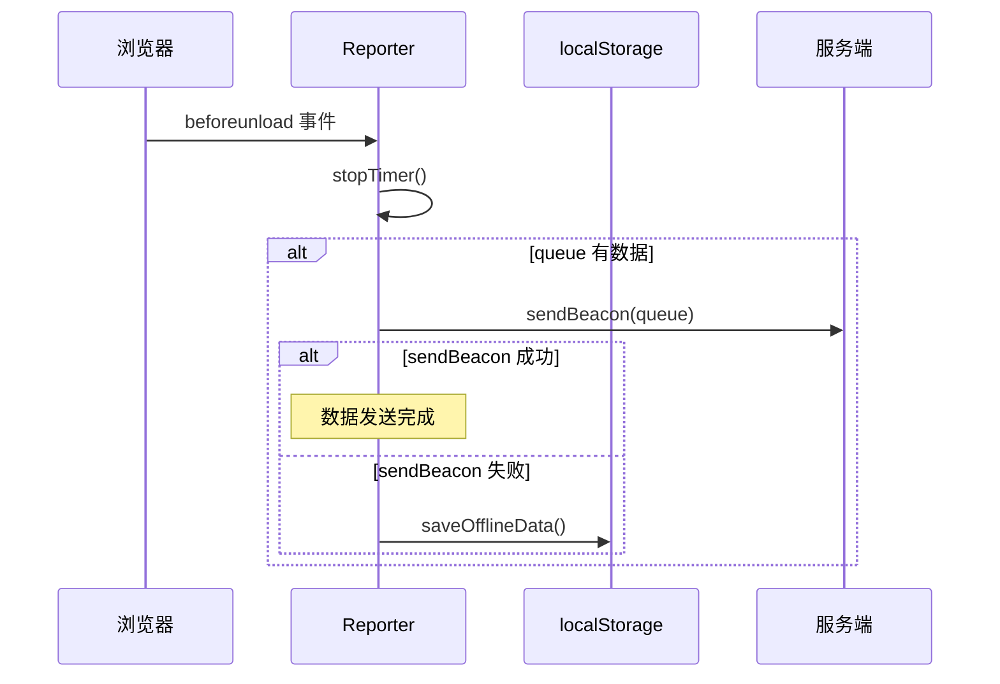

# SDK 架构文档

## 模块概览

```
┌─────────────────────────────────────────────────────────────────────────┐
│                              Monitor (核心)                              │
│                                                                         │
│  ┌─────────────┐  ┌─────────────┐  ┌─────────────┐  ┌─────────────┐    │
│  │ ErrorCatcher│  │ Resource    │  │ Behavior    │  │ Performance │    │
│  │             │  │ Monitor     │  │ Tracker     │  │ Monitor     │    │
│  └──────┬──────┘  └──────┬──────┘  └──────┬──────┘  └──────┬──────┘    │
│         │                │                │                │           │
│         │    onError     │    onError     │  onBreadcrumb  │ onPerf    │
│         └────────┬───────┴────────┬───────┴────────┬───────┘           │
│                  │                │                │                    │
│                  ▼                ▼                ▼                    │
│         ┌────────────────────────────────────────────────┐             │
│         │              Breadcrumbs 管理                   │             │
│         │         (先进先出队列, 最大 N 条)                │             │
│         └────────────────────────────────────────────────┘             │
│                                │                                        │
│                                ▼                                        │
│         ┌────────────────────────────────────────────────┐             │
│         │                  Reporter                       │             │
│         │     (批量上报 / 节流 / 离线缓存 / sendBeacon)    │             │
│         └────────────────────────┬───────────────────────┘             │
└──────────────────────────────────┼──────────────────────────────────────┘
                                   │
                                   │ HTTP POST /api/report
                                   ▼
                          ┌─────────────────┐
                          │     Server      │
                          └─────────────────┘
```

## 类图 (Class Diagram)



## 时序图 (Sequence Diagram)

### 初始化流程



### 错误捕获流程



### 用户行为追踪流程



### 数据上报流程



### 页面卸载流程



## 模块职责说明

| 模块 | 职责 | 输入 | 输出 |
|------|------|------|------|
| Monitor | 核心协调器，管理配置和子模块 | 用户配置 | 初始化各模块 |
| Reporter | 数据上报，处理批量/节流/离线 | ReportData | HTTP 请求 |
| ErrorCatcher | 捕获 JS 错误和 Promise 异常 | 浏览器事件 | ErrorEvent |
| ResourceMonitor | 捕获资源加载失败 | 浏览器事件 | ResourceError |
| BehaviorTracker | 追踪用户行为 | 用户操作 | Breadcrumb |
| PerformanceMonitor | 采集性能指标 | Performance API | PerformanceData |

## 数据流向

```
┌──────────────────────────────────────────────────────────────────┐
│                          数据采集层                               │
│                                                                  │
│  ┌────────────┐  ┌────────────┐  ┌────────────┐  ┌────────────┐ │
│  │ JS 错误    │  │ 资源错误   │  │ 用户行为   │  │ 性能数据   │ │
│  │ onerror    │  │ error事件  │  │ click/xhr  │  │ Perf API   │ │
│  └─────┬──────┘  └─────┬──────┘  └─────┬──────┘  └─────┬──────┘ │
└────────┼───────────────┼───────────────┼───────────────┼────────┘
         │               │               │               │
         ▼               ▼               ▼               ▼
┌──────────────────────────────────────────────────────────────────┐
│                          数据处理层                               │
│                                                                  │
│  ┌─────────────────────────────────────────────────────────────┐ │
│  │                    Monitor (数据聚合)                        │ │
│  │  - 格式化错误数据                                            │ │
│  │  - 关联 Breadcrumbs                                         │ │
│  │  - 采样率过滤                                                │ │
│  └─────────────────────────────────────────────────────────────┘ │
└──────────────────────────────────────────────────────────────────┘
                                │
                                ▼
┌──────────────────────────────────────────────────────────────────┐
│                          数据传输层                               │
│                                                                  │
│  ┌─────────────────────────────────────────────────────────────┐ │
│  │                    Reporter (可靠传输)                       │ │
│  │  - 批量合并                                                  │ │
│  │  - 节流控制                                                  │ │
│  │  - 离线缓存                                                  │ │
│  │  - sendBeacon                                                │ │
│  └─────────────────────────────────────────────────────────────┘ │
└──────────────────────────────────────────────────────────────────┘
                                │
                                │ HTTP
                                ▼
┌──────────────────────────────────────────────────────────────────┐
│                          服务端                                   │
│  - 数据接收验证                                                   │
│  - 错误聚合去重                                                   │
│  - 数据存储查询                                                   │
│  - SourceMap 解析                                                │
└──────────────────────────────────────────────────────────────────┘
```

## 配置项说明

```typescript
interface MonitorConfig {
  dsn: string;              // 项目标识，用于数据隔离
  reportUrl: string;        // 上报服务端地址
  sampleRate?: number;      // 采样率 0-1，默认 1（全量上报）
  maxBreadcrumbs?: number;  // 最大 breadcrumb 数量，默认 20
  enableError?: boolean;    // 启用错误监控，默认 true
  enablePerformance?: boolean; // 启用性能监控，默认 true
  enableBehavior?: boolean; // 启用行为追踪，默认 true
  batchSize?: number;       // 批量上报阈值，默认 10
  reportInterval?: number;  // 上报间隔(ms)，默认 5000
}
```

## 扩展点

SDK 设计了以下扩展点，方便后续功能扩展：

1. **新增监控类型**：实现类似 ErrorCatcher 的类，在 Monitor.init() 中初始化
2. **自定义上报策略**：继承 Reporter 类，重写 send() 方法
3. **数据过滤**：在 Monitor.report() 中添加过滤逻辑
4. **插件机制**：可扩展为插件化架构，动态加载监控模块
